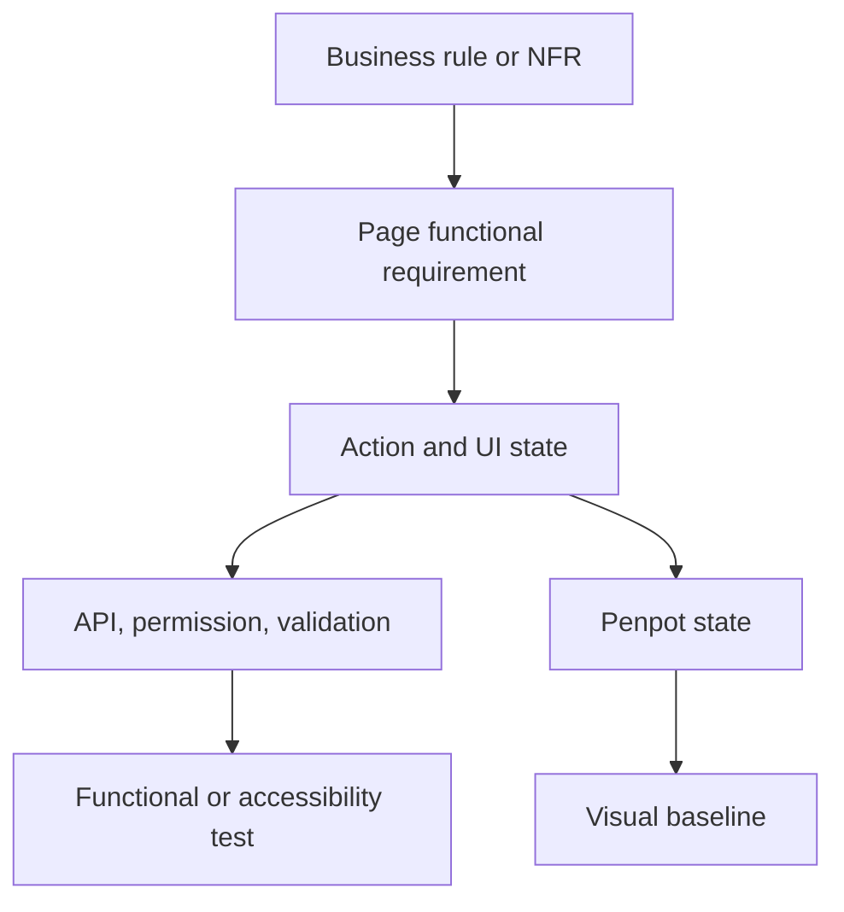

# Nursing Platform — Penpot Desktop Specification and Production Master Plan

```yaml
document_id: NPS-DES-PLAN-001
version: 1.1
status: phase-0-reentry-reconciliation
created_at: 2026-07-23
timezone: Asia/Amman
design_authority: Penpot
design_scope: Desktop browser
manager_model: openai/gpt-5.6-sol
```

## 1. Intended outcome

Build a reliable, repeatable production system for Nursing Platform frontend design in which:

- Penpot is the single visual authority.
- Desktop browser pages are designed first.
- Every canonical routed page has one evidence-backed Markdown specification before visual production starts.
- Business rules, permissions, API contracts, validation rules, security requirements, accessibility requirements, and test scenarios remain traceable.
- The documentation can later drive Angular implementation, functional automation, accessibility automation, and visual regression testing.
- Strong models are used only for planning and approval gates; bounded workers handle narrow, verifiable tasks.
- Progress survives long conversations and new sessions through a durable goal state and versioned artifacts.

This is a specification-first design program. It is not a request to generate Angular code, Tablet boards, Mobile boards, or RTL boards in the current phase.

## 2. Locked decisions

The following decisions are fixed unless Karam explicitly changes them:

| ID | Decision |
|---|---|
| DEC-001 | Penpot is the only visual design authority. |
| DEC-002 | Current production scope is Desktop browser only. |
| DEC-003 | One Markdown specification is created per canonical route-level page or independent route-level user task. |
| DEC-004 | Loading, error, validation, empty, permission, and interaction states normally remain inside the owning page specification; they do not become separate page files. |
| DEC-005 | Shared rules are centralized and referenced by stable IDs rather than copied into every page. |
| DEC-006 | Angular 22, Angular Material, Angular CDK where required, SCSS, and a project-owned custom Angular Material theme are the approved frontend direction. |
| DEC-007 | WCAG 2.2 AA is mandatory. |
| DEC-008 | Arabic and RTL are future production requirements; current Desktop LTR work must preserve readiness without creating RTL boards now. |
| DEC-009 | `openai/gpt-5.6-sol` is the sole model manager and the sole model allowed to approve or reject specifications and agent-produced artifacts. |
| DEC-010 | Human visual review by Karam is required before a Penpot page becomes visually approved. |
| DEC-011 | An agent must never invent a route, permission, field, validation rule, state transition, business rule, API behavior, performance budget, or visual-diff threshold. |
| DEC-012 | `claude-fable-5.md` is excluded from this program because it is unrelated to Nursing Platform requirements. |

## 3. Authority hierarchy and conflict handling

When sources disagree, use this order:

1. Explicit current decisions made by Karam.
2. Approved current product and architecture decisions in the live repository.
3. Approved business requirements.
4. Verified live backend behavior at a recorded Git commit:
   - endpoint mappings and OpenAPI;
   - commands, queries, DTOs, and validators;
   - authorization requirements and exact permission seed names;
   - domain invariants and state transitions;
   - integration and endpoint tests;
   - configuration values that affect the UI.
5. Approved shared frontend/design/test contracts.
6. Page-family patterns.
7. The individual page specification.
8. Penpot for approved geometry, composition, styling, and hierarchy.
9. Agent inference is never authoritative.

If code and documentation disagree, neither is silently chosen as product truth. The discrepancy is recorded in `governance/open-questions.md`, the affected page becomes `blocked`, and the manager requests a decision when the difference affects behavior or design.

Normative words such as `MUST`, `MUST NOT`, and `SHALL` may be used only for approved or evidenced requirements. Unresolved content is written as `OPEN-QUESTION` with source references and impact.

## 4. Evidence audit of the uploaded documentation

The uploaded `01-all_project_markdown_docs.txt` was read completely: 4,193 lines containing 16 project Markdown files.

### 4.1 Confirmed high-level facts

- The product combines paid nursing licensing-exam simulation and nurse recruitment.
- Primary external personas are Nurses and Employers.
- Nurse capabilities include profile data, experience, education, certificates, languages, skills, CV, and recruitment visibility.
- Employer capabilities include organization/company information, contact information, candidate discovery, filtering, profile review, and contact requests.
- Recruitment contact information is disclosed only after an approval workflow.
- Exams include instructions, randomized questions, a timer, auto-grading, rationales, results, and analytics.
- Administration includes user management, exam/question management, reference data, discounts, and reports, with other items appearing in the roadmap.
- The API is versioned under `/api/v1`, uses DTOs, Problem Details, authentication, permission-based authorization, validation, pagination, filtering, sorting, and controlled file uploads.
- Frontend authorization improves UX but never replaces backend authorization.
- Initial non-goals include built-in messaging, video interviews, payroll, hospital management, and clinical scheduling.

### 4.2 Blocking freshness and completeness problems

The uploaded dump cannot be used directly to create final page specifications:

- Its frontend styling stack conflicts with the currently approved Angular Material/CDK + SCSS direction.
- Its `CURRENT_TASK.md`, `TASKS.md`, and `README.md` describe a much earlier project state than the known backend progress.
- Example API routes in the API guide are conventions, not verified live contracts.
- It contains module lists but not complete page-level business rules.
- It does not define exact fields, validation boundaries, permission names, state transitions, error behavior, or release-specific payment behavior.
- Accessibility is described only at a high level and is not yet expressed as measurable WCAG 2.2 AA acceptance criteria.
- Arabic/RTL readiness, browser coverage, Desktop viewport policy, deterministic test fixtures, and visual-regression rules are not sufficiently defined.

Therefore the first execution phase must inspect the live repository at an exact commit and reconcile its current documentation before bulk page generation.

## 5. Scope

### 5.1 In scope

- A canonical Desktop page inventory.
- Shared design, interaction, accessibility, content, and test contracts.
- One evidence-backed Markdown file per approved canonical page.
- Desktop Penpot boards created only from approved page specifications.
- Relevant states and component variants.
- Traceability from business rule to page behavior, API, permission, validation, test, Penpot board, and future visual baseline.
- Human visual review checkpoints.
- A durable progress ledger and an audit trail of decisions, usage, failures, and approvals.

### 5.2 Out of scope for this pass

- Tablet boards.
- Mobile boards.
- RTL or Arabic boards.
- Angular implementation.
- Automated test implementation.
- Backend implementation changes unless a separately approved task authorizes them.
- Business capabilities outside the approved product scope.
- Any second visual-design authority.

### 5.3 Desktop baseline

The current authentication board at `1440 × 1024` is useful precedent but is not yet a repository-wide viewport rule. Before the first production batch, approve:

- canonical screenshot viewport;
- supported Desktop width range;
- browser and version;
- operating system/container image;
- device-pixel ratio;
- font files and font-loading behavior;
- locale and timezone;
- reduced-motion and animation settings.

Recommended pilot baseline: content viewport `1440 × 1024`, English LTR, a pinned Chromium build, device-pixel ratio 1, `Asia/Amman`, deterministic fonts, and disabled animations. This becomes normative only after approval and entry in the shared visual-regression contract.

## 6. Repository documentation architecture

The target structure in the live repository is:

```text
docs/frontend/design/
├── README.md
├── MASTER_PLAN.md
├── GOAL_STATE.md
├── governance/
│   ├── source-authority.md
│   ├── design-authority.md
│   ├── decision-log.md
│   └── open-questions.md
├── evidence/
│   ├── source-map.md
│   ├── authentication.md
│   ├── account.md
│   ├── nurse.md
│   ├── employer.md
│   ├── recruitment.md
│   ├── examinations.md
│   ├── payments.md
│   ├── administration.md
│   └── shared-system.md
├── foundation/
│   ├── design-tokens.md
│   ├── desktop-layout.md
│   ├── angular-material-component-map.md
│   ├── component-contracts.md
│   ├── interaction-and-state-model.md
│   ├── accessibility-wcag-2.2-aa.md
│   ├── content-and-i18n-readiness.md
│   ├── arabic-rtl-readiness.md
│   └── frontend-nfr.md
├── integration/
│   ├── api-operation-index.md
│   ├── permission-index.md
│   ├── validation-index.md
│   └── error-response-index.md
├── patterns/
│   ├── authentication.md
│   ├── dashboard.md
│   ├── list-search-filter.md
│   ├── profile-detail.md
│   ├── form-wizard.md
│   ├── exam-session-results.md
│   └── administration-maintenance.md
├── inventory/
│   ├── page-registry.md
│   ├── route-permission-matrix.md
│   └── coverage-matrix.md
├── pages/
│   ├── authentication/
│   ├── account/
│   ├── nurse/
│   ├── employer/
│   ├── recruitment/
│   ├── examinations/
│   ├── payments/
│   ├── administration/
│   └── shared-system/
├── testing/
│   ├── testability-and-locators.md
│   ├── fixture-catalog.md
│   ├── accessibility-test-matrix.md
│   ├── visual-regression-contract.md
│   └── scenario-index.md
├── penpot/
│   ├── object-map.md
│   └── review-log.md
├── templates/
│   ├── page-spec.template.md
│   └── agent-task-packet.template.md
├── task-packets/
└── reviews/
```

### 6.1 Duplication rule

Shared documents own reusable truth. Page files contain only route-specific composition and behavior.

- Tokens, typography, spacing, colors, common component behavior, generic error presentation, accessibility rules, test environment rules, and visual thresholds are never copied into each page.
- DTOs and validators are indexed with links to live backend sources; they are not manually cloned into every page.
- A page references shared IDs and records only its applicable rules or justified deltas.
- A shared rule change updates one source plus affected traceability links, not dozens of copied paragraphs.

## 7. Canonical page rule

Create a page specification only when at least one of these is true:

- the experience has an independent canonical route;
- it has a distinct route-level user goal;
- it has independent access/permission semantics;
- it requires a structurally distinct browser page and navigation lifecycle.

Do not create a separate page file merely for:

- a loading, empty, validation, error, success, hover, focus, pressed, or disabled state;
- a tab that is not independently routed and does not have an independent business goal;
- a dialog or drawer owned by one page;
- a role variant with the same route, primary goal, and structure;
- a Desktop width variant;
- future Tablet, Mobile, Arabic, or RTL work.

Dialogs, drawers, and tabs move to a shared pattern or component contract only when reused by multiple pages or when they become independently routed workflows.

## 8. Stable ID and traceability scheme

Module codes:

`AUTH`, `ACC`, `NUR`, `EMP`, `REC`, `EXAM`, `PAY`, `ADMIN`, `SHARED`.

| Artifact | Format | Example |
|---|---|---|
| Page | `PG-<MODULE>-NNN` | `PG-AUTH-001` |
| Business rule | `BR-<MODULE>-NNN` | `BR-REC-004` |
| Shared non-functional requirement | `NFR-<AREA>-NNN` | `NFR-A11Y-001` |
| Page functional requirement | `FR-<PAGE-ID>-NN` | `FR-PG-AUTH-001-01` |
| Action | `ACT-<PAGE-ID>-NN` | `ACT-PG-AUTH-001-01` |
| State | `ST-<PAGE-ID>-NN` | `ST-PG-AUTH-001-03` |
| Field | `FLD-<PAGE-ID>-NN` | `FLD-PG-AUTH-001-01` |
| Validation | `VAL-<MODULE>-<USECASE>-NN` | `VAL-AUTH-LOGIN-01` |
| API operation | `API-<MODULE>-NNN` | `API-AUTH-002` |
| Test scenario | `TC-<PAGE-ID>-NN` | `TC-PG-AUTH-001-04` |
| Fixture | `FX-<MODULE>-NNN` | `FX-AUTH-002` |
| Pattern | `PAT-<FAMILY>-NNN` | `PAT-FORM-001` |
| Component | `CMP-<FAMILY>-NNN` | `CMP-FIELD-001` |
| Visual baseline | `VR-<PAGE-ID>-<STATE>-D1440` | `VR-PG-AUTH-001-ST03-D1440` |
| Locator | `LOC-<PAGE-ID>-<NAME>` | `LOC-PG-AUTH-001-SUBMIT` |

Permissions are referenced by exact seeded values, for example `PERM[Users.Create]`. Agents may not rename, normalize, or infer permission aliases.

Required trace chain:



Coverage invariants:

- Every functional requirement maps to at least one test scenario.
- Every server-backed action maps to exactly one indexed API operation or is explicitly marked local-only.
- Every protected action names the exact permission; public actions explicitly say `public`.
- Every form field maps to a request JSON pointer or explains why it is UI-only.
- Every relevant API error has a defined user-facing result.
- Every design-relevant state has a deterministic fixture and representation.
- Every Penpot board maps to one page ID and one state ID; orphan boards are forbidden.

## 9. Page specification contract

Each file begins with machine-readable front matter:

```yaml
---
schema: nps-page-spec/v1
page_id: PG-AUTH-001
title: Sign in
module: AUTH
kind: route
route: /auth/sign-in
pattern: PAT-AUTH-001
actors: [anonymous]
permissions: []
risk: medium
viewport_profiles: [VP-DESKTOP-1440]
locales_designed: [en]
spec_revision: 1
requirements_status: draft
penpot_status: not-started
test_contract_status: draft
implementation_status: not-started
source_revision:
  repository_commit: "<commit>"
  openapi_revision: "<revision-or-hash>"
penpot:
  file_id: null
  page_id: null
  primary_board_id: null
  approved_revision: null
---
```

Allowed status values only:

`not-started`, `draft`, `blocked`, `in-review`, `approved`, `superseded`.

### 9.1 Mandatory sections

Every page file contains these sections in this order:

1. **Purpose and user outcome**
   - primary user job;
   - business value;
   - explicit non-goals.
2. **Authority and traceability**
   - source references;
   - verified repository commit;
   - applicable business, functional, and non-functional IDs;
   - known conflicts and open decisions.
3. **Route and access contract**
   - actor;
   - entry condition;
   - route guard;
   - exact permission or `public`;
   - unauthenticated and unauthorized results;
   - redirects.
4. **Entry points, preconditions, exits, and navigation**.
5. **Page anatomy**
   - region ID;
   - semantic landmark;
   - heading level;
   - component/pattern reference;
   - content source;
   - Penpot logical key.
6. **Data presentation**
   - response JSON pointer;
   - formatting;
   - sensitivity classification;
   - empty, missing, and redacted behavior.
7. **Actions and state transitions**
   - trigger;
   - preconditions;
   - API reference;
   - pending behavior;
   - success effect;
   - failure states;
   - focus and announcement behavior.
8. **API and error contract**
   - operation ID, method, path, and schema references;
   - success statuses;
   - applicable `400`, `401`, `403`, `404`, `409`, `422`, `429`, and `5xx` behavior;
   - retry and idempotency rules from evidence.
9. **Fields and validation**
   - label and content key;
   - control and autocomplete purpose;
   - request pointer;
   - requiredness;
   - validation references and boundaries;
   - normalization;
   - validation timing;
   - error association;
   - sensitive-data behavior.
10. **State coverage matrix**.
11. **Accessibility contract**.
12. **Security and privacy contract**.
13. **Performance and resilience requirements**.
14. **Content, localization, and future RTL readiness**.
15. **Semantic locator contract**.
16. **Functional, integration, end-to-end, accessibility, and visual test scenarios**.
17. **Visual-regression contract**.
18. **Penpot object mapping**.
19. **Acceptance checklist**.
20. **Open questions and prohibited assumptions**.
21. **Change and approval history**.

## 10. State coverage without page explosion

Every page evaluates these state classes and records an applicable state or `N/A` with a reason:

- initial/loading;
- ready/populated;
- empty;
- partial data;
- refreshing;
- submitting;
- client validation error;
- server validation error;
- business conflict;
- unauthenticated/session expired;
- forbidden;
- not found;
- rate limited;
- offline/retry;
- unexpected server error;
- success/navigation outcome.

Each applicable state uses one representation:

- `full-board` — macro layout changes materially;
- `component-variant` — reusable component/state behavior;
- `annotation-only` — behavior is documented but needs no separate visual board;
- `test-only` — important contract with no visual difference.

Default visual cap per page:

- one ready board;
- no more than three additional structurally distinct state boards.

Exceeding the cap requires a recorded risk-based justification approved by the manager. Do not generate the Cartesian product of actor × content × state × error. Choose risk-based and pairwise combinations.

## 11. Accessibility contract

The shared accessibility file converts WCAG 2.2 AA into reusable testable rules. Each page then documents only applicability and deltas.

At minimum, every page specification covers:

- semantic landmarks and one clear page-level heading;
- reading order and keyboard focus order;
- visible focus and focus restoration after dialogs, errors, or navigation;
- accessible names, descriptions, and error associations;
- keyboard behavior for every custom interaction;
- live-region/status announcements;
- contrast and non-text contrast;
- target size and spacing requirements;
- zoom/reflow implications for the Desktop implementation;
- reduced-motion behavior;
- validation identification and recovery;
- time-limit behavior and warnings for exams;
- manual checks that cannot be certified by automation alone.

## 12. Security, privacy, and business-critical treatment

High-risk pages are reviewed individually. These include:

- authentication, recovery, verification, session expiry, and account security;
- role- or permission-sensitive administration;
- nurse PII and CV upload;
- employer access to candidate information;
- recruitment contact approval and disclosure;
- timed exam sessions, auto-submit, scoring, and rationale release;
- orders, discounts, checkout, and payment outcomes.

Design rules:

- UI hiding is never treated as authorization enforcement.
- Sensitive data must declare display, masking, logging, clipboard, and screenshot-fixture behavior.
- Generic security-preserving API responses must remain generic in the UI.
- Double-submit, retry, stale data, conflict, and session-expiry behavior must come from evidenced backend semantics.
- File uploads must record type, size, replacement/deletion, scan, filename, and failure behavior from approved sources.

## 13. Test automation contract

### 13.1 Locator policy

Selector priority:

1. role plus accessible name;
2. label, landmark, heading, or scoped deterministic text;
3. stable `data-testid` only when semantic locators are ambiguous or unavailable.

Forbidden selectors:

- CSS implementation classes;
- XPath;
- `nth-child`;
- generated Angular IDs;
- raw Penpot IDs;
- visible text without a fixed test locale.

Fallback test ID format:

```text
pg-auth-001__form
pg-auth-001__email
pg-auth-001__submit
```

Penpot layers carry logical locator keys, for example:

```text
[LOC-PG-AUTH-001-SUBMIT] Sign in button
```

Raw Penpot object IDs are trace metadata only. They never become Angular or test locators.

### 13.2 Deterministic fixtures

Visual and end-to-end scenarios pin:

- browser and version;
- viewport and device-pixel ratio;
- fonts and font loading;
- locale and timezone;
- clock and dates;
- network responses;
- fictional test identities and PII;
- randomized exam content and question order;
- animation, transition, cursor, and caret behavior;
- external assets and third-party calls.

Use deterministic fictional fixtures instead of masking PII.

### 13.3 Visual masking

Masking is a last resort. Every mask requires a stable mask ID, locator, justification, scope, owner, and approval.

Never mask:

- a whole page or major content container;
- validation or error messages;
- prices, discounts, scores, permissions, entitlement results, or recruitment disclosure outcomes;
- an exam timer when the clock can be frozen;
- content that is the subject of the test.

### 13.4 Two visual references

Maintain two related but distinct references:

1. **Design-conformance reference** — approved Penpot revision/export.
2. **Runtime-regression baseline** — approved Angular browser screenshot.

They are not interchangeable because browser rendering and font rasterization may differ from the design export.

Pixel-diff tolerance is defined once in `testing/visual-regression-contract.md` after a deterministic pilot. Pages may not select their own tolerances.

## 14. Live repository evidence mining

Before final page inventory or page drafting, capture an exact Git commit and extract:

1. Current `CURRENT_TASK.md`, `TASKS.md`, `README.md`, `AGENTS.md`, architecture docs, plans, and decision records.
2. Recent Git history identifying later implementations and documentation updates.
3. Every Minimal API route/group, method, anonymity declaration, authorization requirement, and exact permission name.
4. Current OpenAPI output, checked against endpoint code.
5. Application commands, queries, DTOs, validators, response models, pagination, and error mappings.
6. Domain entities, enums, invariants, and state transitions.
7. EF configurations and migrations that establish requiredness, lengths, uniqueness, relations, and lifecycle states.
8. Seeded roles, permissions, countries, languages, categories, and other controlled vocabularies.
9. Unit, integration, and endpoint tests, including `401`, `403`, `404`, `409`, `422`, rate-limit, and generic security-preserving behavior.
10. Configuration/options for uploads, pagination, token/session timing, and external services.
11. Existing frontend source: dependencies, routes, theme, guards, interceptors, models, current screens, and test configuration.
12. Existing Penpot plans, object trackers, screenshots, exports, foundation decisions, and unresolved findings.
13. Plans for not-yet-implemented modules, clearly labelled `planned` rather than `implemented`.

Each module evidence pack records:

- repository commit;
- implemented capabilities;
- planned capabilities;
- routes and methods;
- request/response schemas by reference;
- validation and business rules;
- actors, roles, and permissions;
- state machines;
- tested errors;
- conflicts and open questions;
- exact source paths and symbols.

## 15. Provisional page families

The following are discovery candidates, not approved page files:

| Family | Candidate route-level goals | Main unresolved boundary |
|---|---|---|
| Authentication | Sign in, registration, verification result, forgot password, reset password | Exact routes, role selection, gating, and redirect rules |
| Account | Current-account summary and security actions | Implemented account scope and routing |
| Nurse | Profile, experience, education, certificates, skills, languages, CV, recruitment visibility | Separate routes versus sections/tabs |
| Employer | Organization profile, candidate search, candidate detail, contact-request management | Ownership, membership, verification, and contact workflow |
| Recruitment | Search/filtering and request lifecycle | Disclosure rules, states, actors, expiry/cancellation |
| Examinations | Catalog, details/instructions, active session, results/rationales, analytics | Entitlement, attempts, timer authority, resume/abandon, scoring |
| Payments | Checkout and order/payment outcome | Current provider scope, states, refunds, currency, discount semantics |
| Administration | Dashboard, users, exams, questions, reference data, discounts, reports, audit/settings if implemented | Exact CRUD, permissions, lifecycle, and current release scope |
| Shared system | Role dashboard, forbidden, not found, page error, session expiry | Which are canonical routes versus shared behaviors |

No candidate becomes a Markdown page until it has an approved page-registry entry.

## 16. Agent orchestration

### 16.1 Non-delegable manager

`openai/gpt-5.6-sol` owns:

- the authoritative plan and goal state;
- task decomposition and task packets;
- authority/conflict reconciliation;
- page boundary approval;
- worker qualification;
- final evidence and traceability review;
- approval or rejection of page specifications;
- approval or rejection of agent-produced Penpot work before human review;
- usage limits, stop decisions, and recovery instructions.

No worker may edit shared governance, inventory, traceability, or goal-state files. No worker may mark a specification or visual as approved.

### 16.2 Worker roles

| Role | Default model | Scope |
|---|---|---|
| Markdown author | `opencode/nemotron-3-ultra-free` | Evidence extraction and page drafts from narrow approved packets only |
| Independent reviewer | `opencode/deepseek-v4-flash-free` | Findings against evidence and schema; no edits or approvals |
| Penpot executor | `openai/gpt-5.6-terra` | Serial execution of approved Penpot packets; no independent design decisions |
| Manager/final reviewer | `openai/gpt-5.6-sol` | Non-delegable decisions and gates |

The author and reviewer defaults must pass a pilot containing one simple page and one high-risk page. Measure omission rate, unsupported claims, source accuracy, schema compliance, correction rate, calls, tokens, and elapsed time.

If the default author fails the pilot twice, the manager may temporarily promote authoring to `openai/gpt-5.6-terra`. There is no automatic model roulette.

`opencode/big-pickle` is outside the critical path:

- it does not write canonical Markdown;
- it does not review or approve;
- it does not edit trackers;
- it does not write to Penpot;
- it is not an automatic fallback.

Mechanical work should use deterministic scripts and schema validation instead of another model whenever practical.

### 16.3 Batch sizes

| Risk | Examples | Maximum batch |
|---|---|---:|
| Simple | Static/read-only page or low-risk auth result | 3 closely related pages |
| Medium | List/search/detail or medium form | 2 pages |
| High | RBAC, PII, uploads, recruitment disclosure, payments, timed exams, scoring, admin | 1 page |

Never mix modules or unrelated page families in one batch.

### 16.4 Concurrency

- One manager is active.
- At most two document workers run concurrently.
- Parallel work is permitted only on disjoint page files after shared contracts are frozen.
- One owner edits each shared index.
- No nested delegation by workers.
- A new batch does not begin until the current batch is approved or stopped.
- Penpot has one executor and one write lease; Penpot writes are always serial.
- The manager and Penpot executor do not mutate the same artifact concurrently.

## 17. Required skill sequence in OpenCode

The exact installed skill instructions take precedence, but the expected sequence is:

### 17.1 Project start or resumed session

1. `using-superpowers`
2. `durable-goal`
3. Read `MASTER_PLAN.md`, `GOAL_STATE.md`, and only the current task packet and evidence pack.
4. `brainstorming` for unresolved product or architecture decisions only.
5. `writing-plans` to create or revise the versioned execution plan.

### 17.2 Markdown batch

1. `executing-plans`
2. `nps-delegate`
3. `opencode-delegate`
4. Choose one:
   - `dispatching-parallel-agents` for independent low-risk pages;
   - `subagent-driven-development` for one high-risk sequential page.
5. `requesting-code-review`
6. `receiving-code-review` if a correction is needed.
7. `verification-before-completion`
8. Manager approval gate.
9. `durable-goal` checkpoint.

### 17.3 Penpot batch

1. `executing-plans`
2. `nps-delegate`
3. `opencode-delegate` to the assigned Penpot executor.
4. `systematic-debugging` only for an actual timeout, partial mutation, or unexpected state.
5. `verification-before-completion`
6. Manager evidence gate.
7. Human visual review.
8. `durable-goal` checkpoint.

Use `test-driven-development` later when implementing linters or automated tests. Use `finishing-a-development-branch` only when closing a milestone. Use `using-git-worktrees` when real parallel repository edits require isolation.

## 18. Agent task packet contract

Every worker receives a bounded packet containing:

- packet ID and page IDs;
- exact role and model;
- allowed files and forbidden files;
- source snapshot commit/hash;
- exact evidence pack and shared-rule versions;
- risk classification;
- required schema and output paths;
- acceptance checks;
- maximum context and output budget;
- explicit forbidden assumptions;
- stop conditions;
- `no delegation`, `no commit`, and `no shared-index edits` rules;
- required final result shape.

Required result shape:

```text
STATUS
FILES_CHANGED
SOURCE_COVERAGE
REQUIREMENT_COVERAGE
VERIFICATION
OPEN_QUESTIONS
ASSUMPTIONS
STOP_REASON
```

If an evidenced rule is unavailable, the worker reports `OPEN-QUESTION`. It may not fill the gap with a likely convention.

## 19. Usage budgets and retry policy

### 19.1 Model calls per batch

| Call | Limit |
|---|---:|
| Manager packet creation | 1 |
| Author drafting | 1 per page |
| Independent batch review | 1 |
| Targeted repair | At most 1 per batch |
| Manager final gate | 1 |

Hard maximums:

- 3 simple pages: 7 model runs.
- 2 medium pages: 6 model runs.
- 1 high-risk page: 5 model runs.

One failed repair stops the batch. Do not enter retry loops.

### 19.2 Context budgets

- Author input: up to approximately 12k tokens per page.
- Page draft: up to approximately 6k tokens.
- Reviewer input: up to approximately 24k tokens per batch.
- Manager final gate: up to approximately 18k tokens containing diffs, coverage, and high-risk evidence.

If a packet exceeds its budget, split the batch. Never send the complete project dump to every worker. Shared rules are referenced by version/hash and loaded only when relevant.

### 19.3 Usage reserve

- At 75% total usage: soft stop; no optional scope or exploratory visual work.
- At 80%: do not start a new manager- or Penpot-executor batch.
- Preserve at least 20% for correction, recovery, and final review.
- Do not keep more than one unapproved batch open.
- Record actual calls and measured usage after the pilot; revise estimates using evidence.
- Do not assume a `-fast` variant is cheaper or better until measured.

## 20. Penpot execution limits and recovery

Before a Penpot page begins:

- its specification status must be `approved`;
- shared tokens/components/patterns must be frozen at recorded versions;
- the task packet carries the spec hash;
- allowed page/frame IDs are explicit;
- a pre-write snapshot records target names, IDs, parents, bounds, and revision.

Execution rules:

- One write operation stream at a time.
- Use targeted reads by stored IDs; avoid repeated full-tree scans.
- Build a region or small atomic group per mutation rather than an entire complex page in one call.
- Reuse shared components and instances.
- Use deterministic layer names and logical keys.
- After a mutation, verify parent, bounds, opacity, text width, clipping, and duplicates with a targeted read.
- Use deterministic contrast calculations; never infer contrast by appearance.
- Keep reports structured and compact.

Recommended per-page ceiling:

| Complexity | Writes | Verification reads | Export attempts |
|---|---:|---:|---:|
| Simple | 4 | 3 | 1 |
| Medium | 6 | 4 | 1 |
| High | 8 | 5 | 1 |

Allow one correction cycle and no more than four additional Penpot calls.

Timeout recovery:

1. Do not immediately repeat a timed-out write; it may have partially succeeded.
2. Read only the target IDs and reconcile actual state.
3. Permit one retry with a smaller atomic scope.
4. A second timeout or unknown partial state blocks the page.
5. Attempt export once. If it times out, request a manual screenshot/export instead of repeating it.
6. Geometry verification never replaces human visual inspection.

## 21. Execution phases

### Phase 0 — Authority and live-repository reconciliation

Deliverables:

- record the Penpot-only authority decision;
- capture live Git commit and working-tree status;
- reconcile current milestone and roadmap status;
- reconcile approved Angular Material/CDK + SCSS architecture in current docs;
- explicitly authorize documentation-only design work in the active milestone;
- create the source-authority and discrepancy register;
- initialize `MASTER_PLAN.md` and `GOAL_STATE.md` in the live repository.

Gate G0: no unresolved source/stack/status conflict that could change the workflow.

#### Phase 0 execution record

Task packet `NPS-DES-PH0-G0-RECONCILE` was explicitly authorized on 2026-07-23 as a documentation-only governance and reconciliation phase.

The reconciliation records:

- live repository commit `2c60554f3de5d35b3c6264e4115d24baedc73568` on branch `main`;
- an uncommitted working tree whose pre-existing changes are preserved and not treated as approved or committed;
- Penpot as the sole visual authority;
- Desktop browser as the only current design-documentation viewport scope;
- Tablet, Mobile, Arabic, and RTL boards as future scope;
- the live 11-page Penpot inventory as evidence only, not visual approval;
- `AUTH-001` and Page 09 as untouched legacy/draft evidence;
- `docs/frontend/design/GOAL_STATE.md` as the owner of this program's durable state;
- `.agent/goal-state.md` as untouched legacy AUTH-001 state;
- unresolved repository and Penpot discrepancies in `governance/open-questions.md` with explicit owners and target phases.

`CURRENT_TASK.md` and `TASKS.md` remain unchanged. Karam's explicit authorization permits this bounded documentation-only Phase 0 work without authorizing Angular implementation, backend implementation, page specifications, or Penpot mutation. The re-entry reconciliation records backend handoff commit `8439511`; Phase 1 remains blocked until this reconciliation diff is reviewed and Gate G0 is explicitly accepted.

### Phase 1 — Evidence packs

Deliverables:

- live API, permission, validation, error, and state indexes;
- one compact evidence pack per business module;
- implemented versus planned labels;
- open-question register;
- provisional page candidates.

Gate G1: every candidate page has sufficient evidence or is explicitly blocked.

### Phase 2 — Shared design and test foundation

Deliverables:

- tokens and custom Material theme contract;
- Desktop layout/profile contract;
- component and interaction/state contracts;
- WCAG 2.2 AA contract;
- Arabic/RTL readiness contract;
- frontend NFR contract;
- locator, fixture, and visual-regression contracts;
- page-spec schema and deterministic linter rules.

Gate G2: shared contracts are reviewed, versioned, and frozen for the pilot.

### Phase 3 — Canonical page inventory

Deliverables:

- route-level page registry;
- page-family assignments;
- route/actor/permission matrix;
- risk classification;
- approved batch order;
- explicit decisions on tabs, overlays, and route boundaries.

Gate G3: no page file can exist without an approved registry entry.

### Phase 4 — Two-page documentation pilot

Choose:

- one simple page;
- one high-risk page.

Run the complete author → independent review → repair if needed → manager gate process. Measure quality and usage. Adjust worker qualification, packet size, and budgets.

Gate G4: both specs pass schema, evidence, traceability, security, accessibility, and automation-readiness review.

### Phase 5 — Page-spec production waves

Recommended order after the pilot:

1. Authentication and account.
2. Shared application shells and role dashboards.
3. Nurse profile.
4. Employer and recruitment.
5. Examinations and payments.
6. Administration.

Batch low-risk related pages; process every high-risk page individually.

Gate G5 per page: requirements and test contract approved; no silent assumptions or unowned blockers.

### Phase 6 — Penpot foundation and family templates

Deliverables:

- Penpot variables/tokens and component set;
- Desktop shell;
- approved family patterns;
- object map and naming conventions;
- a re-evaluation of existing `AUTH-001` as a draft, not an automatic baseline.

Gate G6: components and family templates pass geometry, contrast, naming, instance, and human visual review.

### Phase 7 — Penpot Desktop page waves

For each approved page:

1. generate a design packet from the approved spec;
2. execute serially in Penpot;
3. verify targeted geometry and structure;
4. produce one clear screenshot/export;
5. perform manager traceability review;
6. obtain Karam's visual approval;
7. record board/object IDs and approved revision.

Gate G7: the required boards and variants are visually approved and mapped to the specification.

### Phase 8 — Automation-ready handoff

Deliverables:

- complete scenario index;
- deterministic fixture catalog;
- accessibility automation/manual matrix;
- design-conformance reference mapping;
- future Angular runtime-baseline protocol;
- coverage report with no orphan requirement, page, test, or Penpot board.

Gate G8: each approved page has complete functional, accessibility, and visual automation contracts.

## 22. Review gates

| Gate | Required evidence |
|---|---|
| G0 — Authority reconciled | Current stack, status, authority, and source precedence are resolved |
| G1 — Evidence ready | Route, actor, API, permission, validation, errors, and business sources are known or explicitly blocked |
| G2 — Shared contracts frozen | Schema, design foundation, WCAG, NFR, locator, fixture, and visual contracts are versioned |
| G3 — Inventory approved | Canonical page boundary, route, family, risk, and batch ownership are approved |
| G4 — Specification verified | Unique IDs, valid references, state coverage, tests, fixtures, locators, security, and accessibility pass |
| G5 — Approved for design | Requirements and test contracts are approved and the spec hash is frozen |
| G6 — Penpot evidence verified | No orphan/detached/duplicate objects; geometry and contrast pass; manager review complete |
| G7 — Human visual approval | Karam reviews a clear page image and explicitly accepts it |
| G8 — Automation ready | Requirement-to-test-to-board coverage is complete and deterministic |

No gate may be skipped. A worker report is evidence for review, not proof of completion.

## 23. Deterministic verification

Use scripts and repository checks, not model judgment, for:

- YAML/front-matter schema validation;
- mandatory heading presence;
- unique page, requirement, state, test, fixture, locator, and visual IDs;
- valid source paths and internal links;
- exact permission-name validation against the permission index;
- API reference validation against the API index;
- every functional requirement having at least one test;
- every applicable state having a fixture and representation;
- no unresolved `OPEN-QUESTION` in an approved spec;
- no orphan Penpot boards in the object map;
- no active references to another design authority;
- Markdown lint and clean Git diff checks.

Model review focuses on meaning, omission, contradiction, security, and business correctness.

## 24. Stop conditions

Stop the affected page or batch immediately when:

- current sources conflict and the difference affects design or behavior;
- a route, endpoint, permission, field, validation rule, or business transition lacks evidence;
- source excerpts are insufficient;
- a requirement has no trace chain;
- a worker invents a fact or hides ambiguity;
- a schema or deterministic check fails;
- one targeted repair does not resolve blocker/major findings;
- a provider/model fails and no approved fallback exists;
- the hard usage reserve is reached;
- a specification changes after its Penpot packet is created;
- Penpot IDs change unexpectedly, duplicates appear, or parent/bounds/opacity/text geometry is incorrect;
- a mutation timeout leaves unknown state;
- an accessibility blocker exists;
- no clear image is available for human visual review.

## 25. Main risks and controls

| Risk | Control |
|---|---|
| Stale documentation drives incorrect screens | Live-repository evidence packs at an exact commit; G0/G1 blockers |
| Agents invent business behavior | Exact source references, `OPEN-QUESTION`, independent review, manager gate |
| Page count explodes | Canonical route-level page rule and state representations |
| Rules drift between pages | Shared ID-based contracts and no copied global prose |
| Strong-model usage is exhausted | Narrow packets, small batches, free workers after qualification, hard usage reserve |
| Weak model produces plausible but wrong content | It cannot approve; paired evidence review; manager reads high-risk sources directly |
| Visual errors repeat | Approved spec first, reusable components, serial Penpot execution, targeted geometry verification, human review |
| Penpot timeouts cause duplicate/partial objects | Read-before-retry, atomic mutations, stored IDs, one retry, stop on unknown state |
| Visual tests become flaky | Pinned environment, deterministic fixtures, limited justified masks, one global tolerance policy |
| Future Arabic/RTL becomes expensive | Logical alignment, content expansion, component readiness, and i18n keys documented now |
| Backend and page docs drift | Commit/revision metadata and impact review when indexed contracts change |

## 26. Definition of done

### 26.1 Page specification done

A page spec is done only when:

- it has an approved registry entry and stable page ID;
- sources are tied to a verified commit;
- route, actors, access, permissions, fields, validation, APIs, errors, and business rules are evidenced;
- applicable states are covered without invented combinations;
- WCAG 2.2 AA and security/privacy requirements are explicit;
- every functional requirement maps to tests;
- visual scenarios, fixtures, locators, and screenshot roots are deterministic;
- deterministic lint passes;
- independent review findings are resolved;
- the manager marks requirements and test contracts `approved`.

### 26.2 Penpot page done

A Penpot page is done only when:

- it was built from an approved spec hash;
- required shared components and variants are used;
- board/object IDs are recorded;
- geometry, parentage, bounds, opacity, clipping, text width, duplicate, and contrast checks pass;
- a clear image is available;
- manager traceability review passes;
- Karam explicitly approves the visual result.

### 26.3 Program done for Desktop design documentation

The program is done when:

- every approved Desktop page is specified, mapped, and visually approved;
- all required functional, accessibility, and visual scenarios are indexed;
- no orphan business rule, page, test scenario, or Penpot board exists;
- all blockers and deferred decisions have owners and target phases;
- `GOAL_STATE.md` records the exact resume or handoff point;
- the documentation is synchronized with the live repository.

## 27. Current review checkpoint

Phase 0 re-entry reconciliation and the 2026-08-12 documentation-only conflict-resolution/screen-continuation mapping are awaiting review. G0 remains not accepted.

```text
TASK: NPS-DES-PH0-REENTRY-8439511
STATUS: G0 not accepted; awaiting human review
MANAGER: openai/gpt-5.6-sol

REVIEW:
- docs/frontend/design/MASTER_PLAN.md
- docs/frontend/design/GOAL_STATE.md
- docs/frontend/design/governance/source-authority.md
- docs/frontend/design/governance/decision-log.md
- docs/frontend/design/governance/open-questions.md

NEXT ACTION:
- Karam reviews the complete diff and Git status against backend evidence baseline `8439511` and design-governance baseline `1c22b59`.
- Gate G0 is not accepted until Karam explicitly approves this reconciliation.
- If accepted, separately authorize a bounded Preparation Package Phase 1 evidence packet for the implemented backend-ready areas only.

NO PENPOT WRITES. NO PAGE SPECS. NO ANGULAR OR BACKEND CODE.
NO STAGING OR COMMIT UNTIL EXPLICITLY AUTHORIZED.
```
